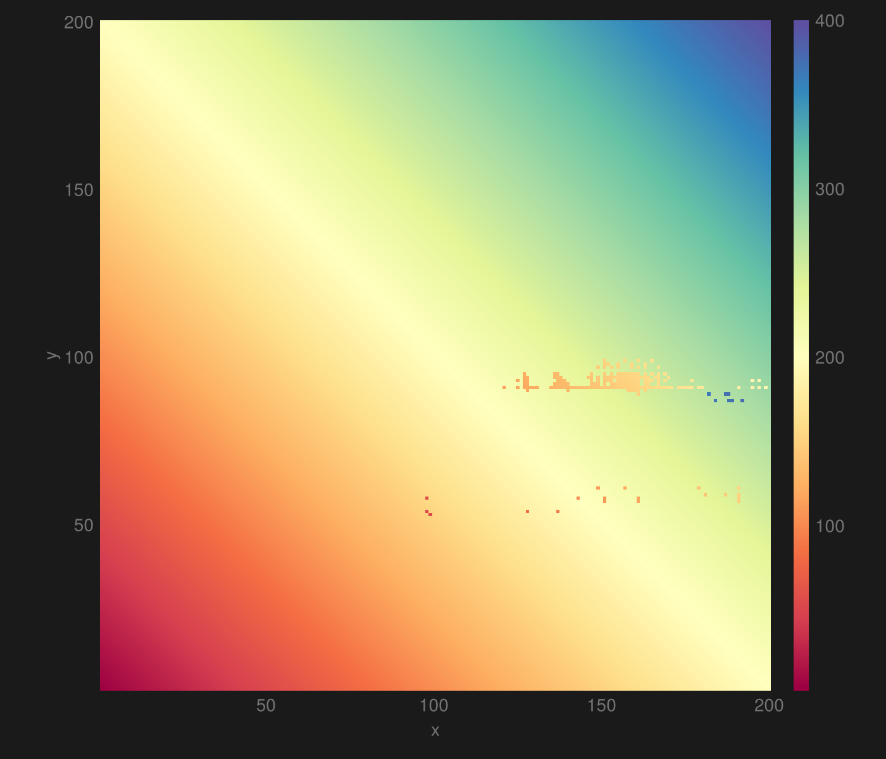
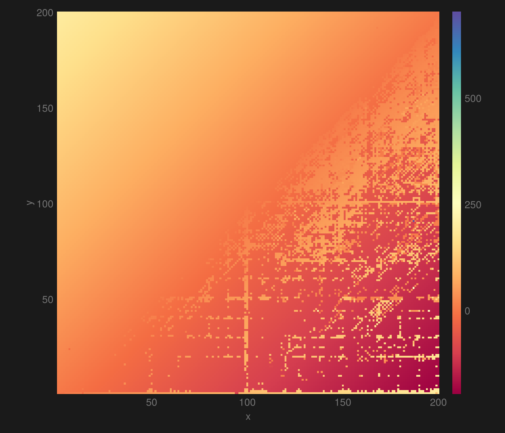
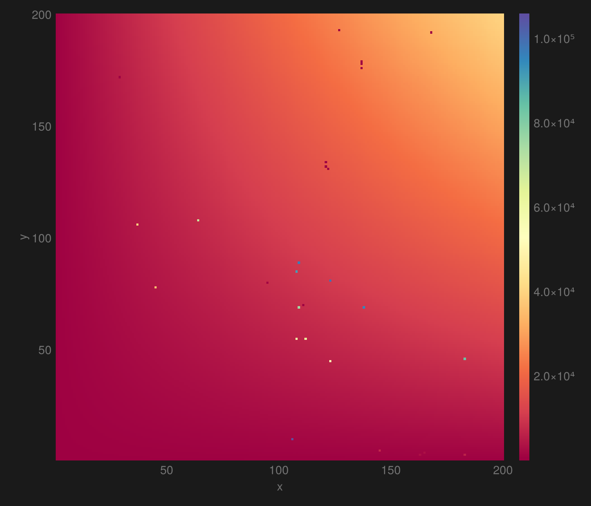

# Exhaustive arithmetic from LLMs

When working on the [LLM reasoning article](../../writing/about/large-language-model-reasoning#exploring-their-limits), I explored the limits of a certain arithmetic capability of a set of LLMs.

This made me curious about how consistent llms are doing simple arithmetic. So I did a little experiment with Llama 3 8B.

I used the chat/completions endpoint of a [llama.cpp](https://github.com/ggerganov/llama.cpp) server to adhere to the prompt template. The temperature was 0.
The system prompt was "Only respond with a single number." All the user queries were of the form `y+x=`.
The code to replicate the experiment are in [the github repository](https://github.com/arnfaldur/arnaldur-be/tree/master/src/routes/experimenting/with/large-language-models-1/plots) for this site.

This shows $$y+x$$ for all combinations of numbers in the range $$[1..200]$$.

I started with the range $$[1..,100]$$ but there were only three mistakes. Those mistakes are all in the vein of $$54+99=53$$, omitting the hundred.
To get more interesting results, I expanded the range.

Here is $$y-x$$:

The It struggles a lot with the negative numbers but nails the positive ones.
Note the very high range of the histogram bar; there is a single extreme outlier in there, causing it, see if you can find it.

Finally $$y\times x$$:

This one looks consistent but $$19566/40000$$ of the values are erroneous; with a lot of small mistakes like $$82\times 2=166$$.
254 are off by 1% or more, while 32 are off by more than 10%.
There are a few extreme outliers, like $$106 \times 10 = 106000$$, which is an understandable error to make in the lexical world of LLMs.

## The true origins of the idea

There is a thought experiment I ponder sometimes.
What would I do if I had a practically infinitely performant computer?
There are of course many interesting things to do with such a device.

One bad idea is to create an AI, using naïve brute force search.
First you need an impenetrable sandbox to run the experiment within.
Then you generate all <abbr data-title="for example">C</abbr> programs that are less than a trillion characters, you have limitless compute, so why not?
There's bound to be a pretty smart AI in there.
Next you design a output format that's easy to grade; a next word probability could be a good choice, similar to LLM logits.
After that you filter out the programs that don't compile, crash, take too long to respond, and don't respond in the desired format.
Then you can essentially train it like an LLM, but instead of losses and checkpoints, you get rankings for all the programs.

An interesting aspect of this method is that the primary challenge is to find anything useful among the roughly $$96^{10^{12}}$$ programs in the set.
For perspective, if you found a way to remove 90% of the worst programs, you would need to do that two trillion times to get them down to one.
The problem would likely be completely intractable, that is, no matter what you do, you would always end with a vast amount of programs tied for first place that produce nonsense when you give them something that's not in the training data.

I still find it interesting to think of approaches to solve this supernatural problem.
One _training_ set I would use is to evaluate a large amount of arithmetic expressions.
They're easy to generate, validate, and can be made arbitrarily complex.
A large subset of the programs would of course just include a calculator and be able to solve pass this test perfectly.
This method would at least find that subset.

I figured that it could be interesting to try this approach with real LLMs to see how they fare.
That is the true origin of this experiment.
