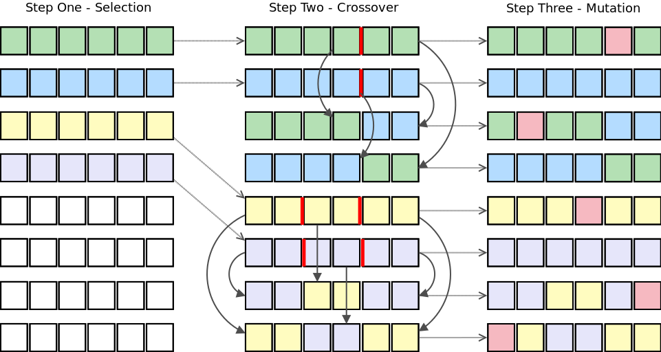

export const title = "Solving Robozzle (Part 1)"
export const date = new Date("2019-11-23T18:29:41.338")
export const topic = ["programming"]

# Solving Robozzle Part 1

Robozzle is a game about programming a robot using a [context-sensitive grammar](https://en.wikipedia.org/wiki/Context-sensitive_grammar).
The game consists of multiple user-designed puzzles.
A puzzle is designed within a 12⨯16 grid, where each square can either be empty or a tile in one of three colors: red, green, or blue.
A tile can have a star on it.
The goal of the game is to program the robot to collect all the stars.
Click on the picture to try it out. I recommend it, it's fun.
 <del>As I wrote this, I discovered that the Robozzle website is down.
I got in touch with its creator, hoping to bring it back online.</del>
 <ins>He has responded and reinstated the website.</ins>

## The rules of the game

The player programs the robot using a set of symbols arranged into functions.
The puzzle's design dictates the length and number of functions available.
The constraints are that there can be no more than five functions, and each function can be up to 10 symbols long.
At the start of the program's execution, the first function is pushed on top of the stack.
There are 11 symbols: forward, left, and right, one symbol for each available function, and three marker symbols.
A function symbol pushes its respective function on top of the stack. A marker symbol colors the tile the robot is standing on in the color of the marker.
The puzzle designer can specify which marker symbols are available. They are usually only enabled in complex puzzles.

Each symbol can be gray or colored. If it's gray, it's executed whenever it is popped off the stack. If it's colored, it is only executed if it matches the color of the tile the robot is currently on.

These rules allow for a wide variety of puzzles that can require complex programs to solve.

## Back in university

I was in a class called problem-solving. It was the most interesting and engaging course I have taken.
One of the course's assignments involved solving 10 [Robozzle](https://robozzle.com) puzzles with increasing difficulty.
The puzzles in question are unfortunately lost to time.
The first 8 were easy, with the last of those posing an interesting challenge. The ninth, however, had me stumped and I could see no rhyme or reason to its layout.
Thus, I promptly decided to write a program to solve it for me.

This turned out to be a bit more difficult than I had anticipated, but about two months' worth of spare time later, I had written a solver that could solve puzzle 9.
I wrote the solver in [Julia](https://julialang.org) and utilized a [Genetic Algorithm (GA)](https://en.wikipedia.org/wiki/Genetic_algorithm) to find solutions.

I had recently learned about genetic algorithms and was excited to find a use for them.

## Genetic Algorithms

are a type of [evolutionary algorithm](https://en.wikipedia.org/wiki/Evolutionary_algorithm) that aims to find solutions to problems by drawing inspiration from the way genetics work.

A GA requires a fitness function that evaluates candidates and gives them a score.
A candidate is a program that consists of one or more functions, each containing nil or more symbols. A solution is a candidate that makes the robot get all the stars.
All non-solutions should have lower scores than solutions.
The GA maintains a pool of candidates that are initially randomly generated.
The properties of the fitness function are critical to the algorithm's success.
The fitness function I designed valued collecting stars highly and included a couple of heuristics whose purpose was to guide the search.
For example, it rewarded moving to a heretofore untouched tile while incurring a small penalty for each move to encourage shorter solutions.

Ideally, solutions have the highest scores, candidates genetically similar to a solution have high scores, and candidates genetically dissimilar to solutions have the lowest scores.
This means that when applied to high-scoring candidates, genetic transformations like crossover and mutation should have an increased chance of generating other high-scoring candidates.

This vector drawing illustrates the three primary stages of a genetic algorithm: Selection, Crossover, and Mutation.
During the Selection stage, the algorithm chooses the fittest individuals from the population.
The Crossover stage combines genetic information from two parents to create new offspring.
The Mutation stage introduces small, random changes to the offspring's traits to ensure genetic diversity.

The GA starts by selecting some of the highest-scoring candidates. Then, as seen in step two of the diagram, it breeds them together, and finally, it applies random mutations to the offspring.

With the help of a crude multithreading method[^1] and many optimizations, I solved puzzle 9, but there was no way it would solve problem 10.

I suspect that GA is not a good fit for this problem as there is little correlation between the genetic similarity of candidates and their scores.
It's easy to imagine a solution that would stop working if any one symbol were changed, giving it a low score.
This method could only find such a solution by randomly guessing it from scratch or through a lucky crossover and mutation, which is likely not much better than a brute force solver.

The solver could solve the first eight puzzles and, given plenty of time, the ninth.
It could also solve many of the simpler puzzles I found on the official Robozzle website but it got lost when attempting most medium to hard difficulty challenges.

[^1]: I simply ran multiple instances of the solver manually and monitored the output of each. The solver randomly sampled the solution space, so conflicts and repeated work were unlikely.
