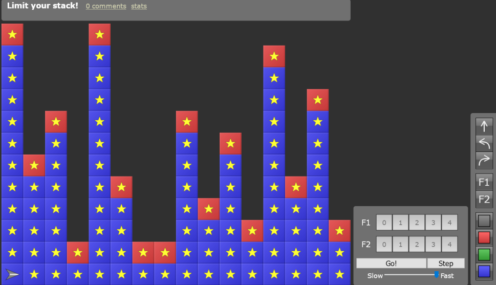
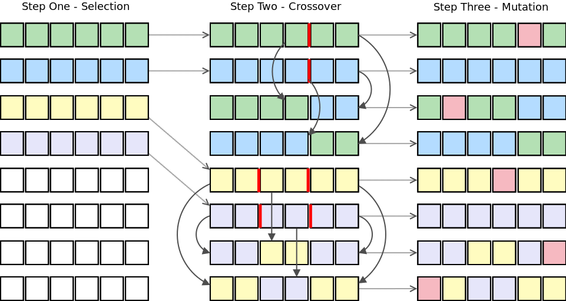

### Robozzle

is a game about programming a robot using a [context-sensitive grammar-like](https://en.wikipedia.org/wiki/Context-sensitive_grammar) programming language.
The game consists of multiple user designed puzzles. Each puzzle is designed on a 12\*16 grid, where each square is either a tile or empty. A tile has one of three colors, red, green, or blue and might have a star on it. The objective is to instruct the robot to collect all the stars.

The robot is programmed using a set of symbols, arranged into functions. The length and number of functions can be controlled by the puzzle designer and is embedded in the puzzle. The constraints are that there can be at most five functions and each functions maximum length is 10 symbols. At the start of the execution of the program, the first function is pushed on top of the stack. There are 11 symbols in total, they include: forward, left, and right, one symbol for each function, and three marker symbols. The designer can specify which marker symbols are available. A function symbol pushes it's respective function on top of the stack. A marker symbol colors the tile the robot is standing on in the color of the marker.

Each symbol can either be gray or colored. If it's gray, it's executed whenever it's popped off the stack. If it's colored it is only executed if it's color matches the color of the tile which the robot is currently on.

These rules allow for a wide variety of puzzles that can require very complex programs to solve.

### A couple of years ago

I was in a class called problem solving. I have never had as much fun in any course and i've been through art school.
There was one assignment where we had to solve 10[^1] [Robozzle](https://robozzle.com) puzzles with increasing difficulty.
The first 8 were pretty easy with the last of those posing an interesting challenge. The ninth did however have me stumped and I could see no rhyme or reason to its layout. Thus I promptly decided to just write a program to solve it for me.

This turned out to be a bit more difficult than I anticipated but about 2 months worth of spare time later I had written a solver that could solve puzzle 9. The solver was written in [Julia](https://julialang.org) and utilized a [Genetic Algorithm](https://en.wikipedia.org/wiki/Genetic_algorithm)&mdash;abbreviated as: GA&mdash;to find solutions.

The saying goes "When all you have is a hammer, everything is a nail". When you combine that with the Frequency illusion, also known as the Baader-Meinhof effect, you end with greedygrasping[^2]. I had recently learned about GA and may have greedygrasped the problem.

##### A Genetic Algorithm

is a type of [evolutionary algorithm](https://en.wikipedia.org/wiki/Evolutionary_algorithm) that aims to find solutions to problems that draws inspiration from the way genetics work.

A GA requires a fitness function that evaluates candidates[^3] and gives them a score. All non-solutions should have lower scores than solutions. The GA maintains a pool of candidates that is initially populated with randomly generated candidates. For GA to work, there must be a genetic similarity between solutions with similar scores. This means that genetic transformations like crossover and mutation, applied to high scoring candidates, should generate other high scoring candidates.

The GA starts by selecting some of the highest scoring candidates. Then it breeds them together as seen in step two of the diagram. Then random mutations are applied to the offspring.

With the help of the most crude multithreading method[^4] I can think of and a lot of optimizations I managed to solve puzzle 9 but I had lost faith in the slightest possibility of my solver solving problem 10.

I suspect that GA is not a good fit for this problem as there is very little correlation between genetic similarity of candidates and their score. It's easy to imagine a solution that would stop working if any one symbol were changed giving it a low score. This method could only find such a solution by randomly guessing it from scratch or through a very lucky crossover and mutation(perhaps with multiple mutations at once), which is effectively just as good as using a brute force solver.

[^1]: There were around 10 puzzles, not sure exactly but I assume they were 10 in this whole post.
[^2]: To **greedygrasp** is to apply newfound knowledge because of excitement for the knowledge, rather than its relevance to the situation. I just made this word up and am unsure if greedygrasp is the best word to describe this.
[^3]: A solution is a candidate that makes the robot get all the stars. A candidate is a program that consists of one or more functions, each containing nil or more symbols.
[^4]: I simply ran multiple instances of the solver manually and monitored the output of each. The solver worked by randomly sampling the solution space so conflicts and repeated work was not a big concern.
