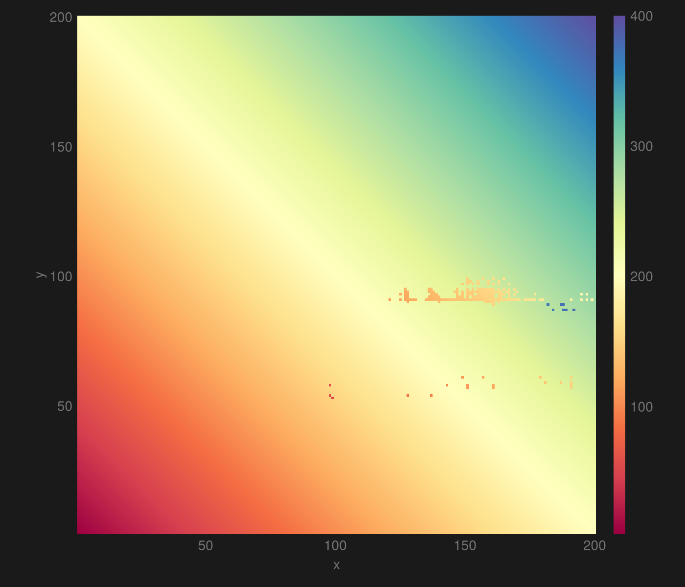
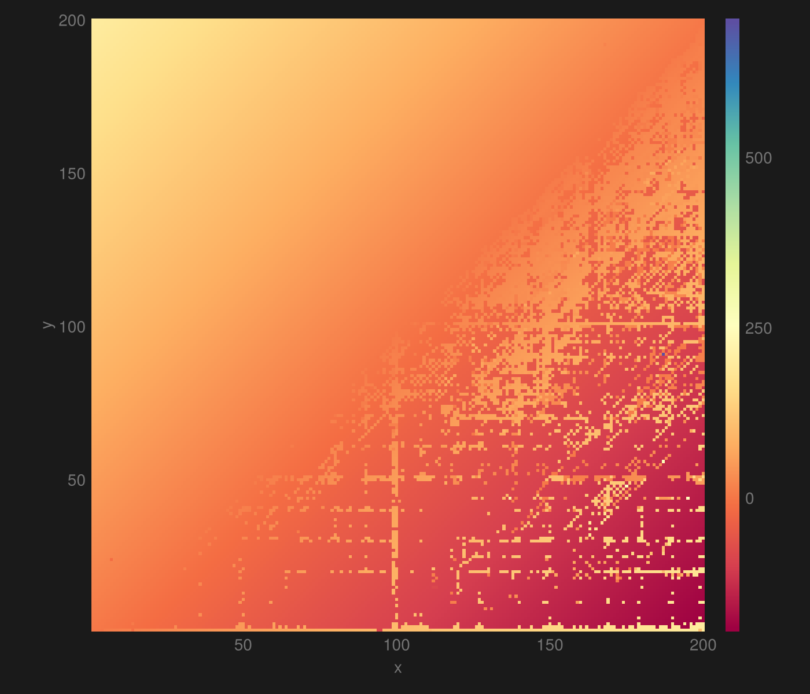
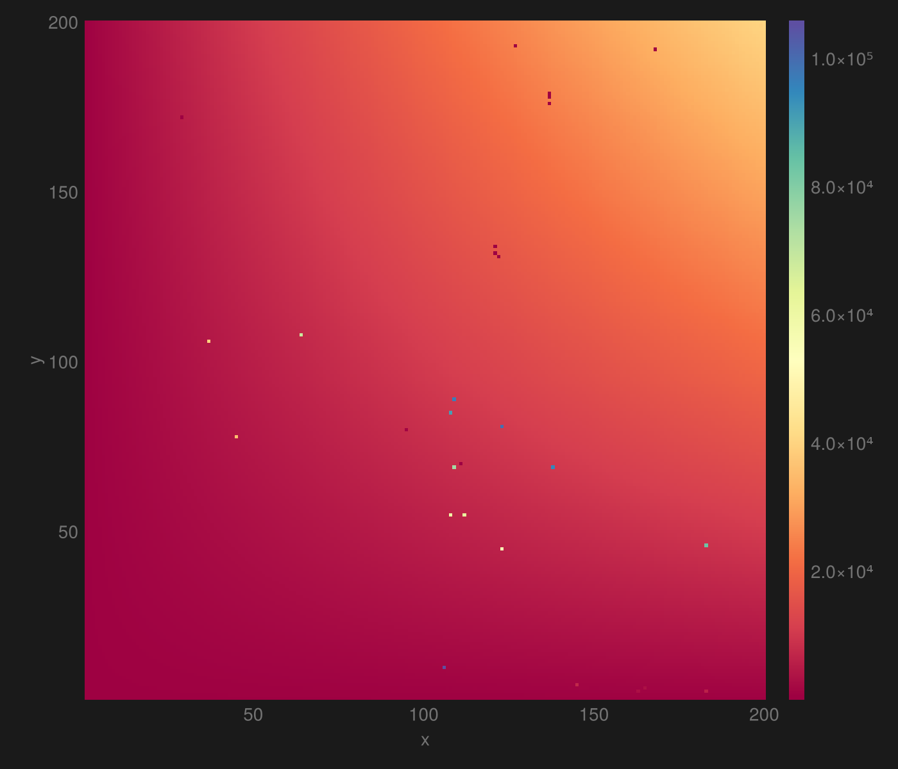

# Exhaustive arithmetic from LLMs

When working on the [LLM reasoning article](../../writing/about/large-language-model-reasoning#exploring-their-limits), I explored the limits of a certain arithmetic capability of a set of LLMs.

This made me curious about how consistent llms are doing simple arithmetic. So I did a little experiment with Llama 3 8B.

I used the chat/completions endpoint of a [llama.cpp](https://github.com/ggerganov/llama.cpp) server to adhere to the prompt template. The temperature was 0.
The system prompt was "Only respond with a single number." All the user queries were of the form `y+x=`.
The code to replicate the experiment are in [the github repository](https://github.com/arnfaldur/arnaldur-be/tree/master/src/routes/experimenting/with/large-language-models-1/plots) for this site.

This shows $$y+x$$ for all combinations of numbers in the range $$[1..200]$$.

I started with the range $$[1..,100]$$ but there were only three mistakes. Those mistakes are all in the vein of $$54+99=53$$, omitting the hundred.
To get more interesting results, I expanded the range.

Here is $$y-x$$:

The It struggles a lot with the negative numbers but nails the positive ones.
Note the very high range of the histogram bar; there is a single extreme outlier in there, causing it, see if you can find it.

Finally $$y\times x$$:

This one looks consistent but $$19566/40000$$ of the values are erroneous; with a lot of small mistakes like $$82\times 2=166$$.
254 are off by 1% or more, while 32 are off by more than 10%.
There are a few extreme outliers, like $$106 \times 10 = 106000$$, which is an understandable error to make in the lexical world of LLMs.
