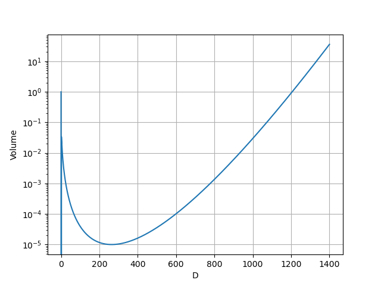

# An n-ball Between n-balls
There is a geometric thought experiment that is often used to demonstrate the counterintuitive shape of high-dimensional phenomena. This article is an interactive visual journey into the construct in the thought experiment, and the mathematics behind it.

## A Square with Four Circles
We start with a $$4 \times 4$$ square. There are four blue circles, with a radius of one, packed into the box. One in each corner.
At the center of the box is a red circle. The red circle is as large as it can be, without overlapping the blue circles.
Drag the slider to add a third dimension.
On this and all other 3D diagrams, you can drag the image to rotate it, and scroll to zoom.

import { Diagram1 } from "./diagrams/Diagram1";

<Diagram1 />

When extending the construct to 3D, many things happen.
All the circles are now spheres, the red sphere is larger while the blue spheres aren't,
and there are eight spheres while there were only four circles.

The dimensional extension is decomposed into three phases.
First, the circles and square turn into spheres and a cube.
Next, the central ball grows, and everything else shifts so that it ends in the center.
Finally, four new spheres appear, completing the 3D version of the construct.

### Defining the Construct
There are more than one way to extend the construct into higher dimensions, so to make it more rigorous, we will define it like so:
An $$n$$-dimensional version of the construct consists of an $$n$$-cube with a side length of $$4$$.
On the midpoint between each vertex and the center of the $$n$$-cube, there is an $$n$$-ball with a radius of one.
In the center of the $$n$$-cube there is the largest $$n$$-ball that does not intersect any other $$n$$-ball.

## Building Intuitions
We want to extend it into any amount of dimensions but before that, we'll build some intuitions.

### 2D Intersection of 3D Construct

import { Diagram2, Former, Latter } from "./diagrams/Diagram2";

<Diagram2 />

In the default configuration, the intersecting plane is the same as the construct in 2D.
We see that when we rotate the plane along the center of the left balls, the balls on the right, vanish and are replaced---within the plane---by the two balls, diagonally across.
There are a few important behaviors to note from this interactable.

1. When the red ball migrates from the 2D center to the 3D center, it shrinks and vanishes from the 2D plane.
2. As seen in the isolate plane perspective, the left balls maintain their size and only shift slightly away from the center.
3. The differences between the <Former/> and <Latter/> configuration.
    1. The enclosing box's width grows from $$4$$ to $$4\sqrt{2}$$.
    2. Similarly, the balls' horizontal positions shift from $$\pm 1$$ to $$\pm \sqrt{2}$$
    3. The red ball's radius $$r$$ grows from $$\sqrt{2} - 1$$ to $$\sqrt{3} - 1$$

### 1D Intersection of 3D Construct
import { Diagram3 } from "./diagrams/Diagram3";

<Diagram3 />

This diagram demonstrates the same phenomena as before, except the intersection is one dimensional and diagonalizes first into two, then three dimensions.
Notice the similarities between the previous two diagrams.
The left *ball* shifts to the left, maintaining it's size, while the right ball vanishes to be replaced by another farther away.

Now we perform the same diagonalization operation, starting from three dimensions.
As visualizing higher dimensions is not intuitive, we can't rely on a lower dimensional intersection of a higher dimensional object to guide us.
The similarities should be evident however.

### 3D Intersection of 10D Construct
import { Diagram4, SideView } from "./diagrams/Diagram4";

<Diagram4 />

Two of the boxes dimensions maintain their constant height of $$4$$ while the third elongates to disect the remaining eight dimension of the 10D construct.
It's length transitions from $$4 = 4\sqrt{1}$$ up to $$4\sqrt{8}$$,
the length of the longest diagonal of an $$8$$ dimensional box.

Viewing the fully diagonalized construct from the <SideView /> we can see the property it's known for. The red ball reaches outside of the green box. Pieces of the red ball are outside the green box. This is absurd when considering how enclosed it is in the two and three dimensional versions, and even if it's mathematically clear that $$r > 2$$ when $$D > 9$$, the fact is hard to accept.

Some people have tried to analogize this property to spikiness 
[[1](https://stanislavfort.com/blog/sphere-spilling-out/)]
[[2](http://www.solipsys.co.uk/new/SpikeySpheres.html?HN_20161120)] of the red ball.
I don't think the analogy is good.
A 3D sphere is perfectly circular, no matter how you slice it.
Similarly, an n-dimensional hyperball, is perfectly spherical from all perspectives.
It's ballness just reaches into more hard to grasp dimensions than we're used to.

### Hamming's lecture
Here is a segment from a lecture that reveals this fact without mincing words.

https://www.youtube.com/watch?v=uU_Q2a0S0zI&t=1716s

## Further Analysis

A unit n-cube has a unit <abbr data-title="n-dimensional volume">volume</abbr> for any $$D$$.
A unit n-ball has a volume of $$\frac{\pi^{D/2}}{\Gamma(D/2+1)}$$ which rapidly approaches zero as $$D$$ grows.
Intuitively, a sphere and a cylinder are both 3D extensions of a circle.
There is more volume in the cylinder than the sphere.
With some imprecision, we can thus consider the sphere loosing some volume when a dimension is added, while a cylinder or a box do not.
This *volume loss* occurs in every additional dimension.
So instead of considering n-balls to be spiky, it's the space around them that outgrows them.

### Cubing the Ball
The volume of the red ball is:
$$
\frac{\pi^{\frac{D}{2}}\bigl(\sqrt{D}-1\bigr)^D}{\Gamma\left(\frac{D}{2}+1\right)}
$$
and if we normalize the size of the green box to 1 by dividing it's sidelength by 4, the volume of the red ball becomes:
$$
V(D) = \frac{\pi^{\frac{D}{2}}\left(\frac{\sqrt{D}-1}{4}\right)^D}{\Gamma\left(\frac{D}{2}+1\right)}
$$

Which has this plot:

There are a few notable/interesting values of $$D$$.

* $$V(0) = 1$$
* $$V(1) = 0$$
* $$V(2) \approx 0.033688...$$
* $$V(264) \approx 0.00001000428...$$ (a local minimum)
* $$V(1206) \approx 1.01158...$$ (smallest $$V(D) \geq 1 \mid D > 0$$)
* $$V(1390) \approx 29.741...$$
Here the red ball's volume exceeds the box's volume by the a larger ratio than the square exceeds the area of the circle, when $$D=2$$
* $$V(1405) \approx 39.499...$$ The same as above but $$D=3$$
* $$V(1486) \approx 186.299...$$ The same as above but $$D=10$$

Not only does some of the ball reach outside of the box (as happens when $$D=10$$) it goes much further.
A more adventurous mathematician than me can try to find the value of $$D$$ when the volume of all the [hyperspherical caps](https://en.wikipedia.org/wiki/Spherical_cap#Hyperspherical_cap) become more than half of the volume of the sphere. 
At that point, most of the ball's volume is outside the box. At $$D=1206$$ the ball becomes larger than the box and as $$D$$ increases, the relative size of the ball grows without bound.

### 3D Intersection of 1206D Construct
import { Diagram5 } from "./diagrams/Diagram5";

<Diagram5 />

Here we see the relative scale of the red ball in 1206D.
Note that as above, this is a perfectly valid 3D slice of the construct; 
a high dimensional being could, with the right tools, carve this out of the construct, **with a single straight cut**. 
There are however, many other ways to slice the construct that look different,
similarly to how each slice of a tomato is distinct.

### Other related stuff

[Here is a Desmos calculator interactable](https://www.desmos.com/calculator/osvrtc1t9m) that visualises an orthogonal 2D slice of the 10D construct. Notice how much empty space there is between the balls.

[This article](https://thenullhypodermic.blogspot.com/2019/12/high-dimensional-weirdness.html) was a great inspiration, and the reason I considered the 1206D construct and beyond.

{
// https://x.com/fdalmaso/status/1818650977672569085
}
