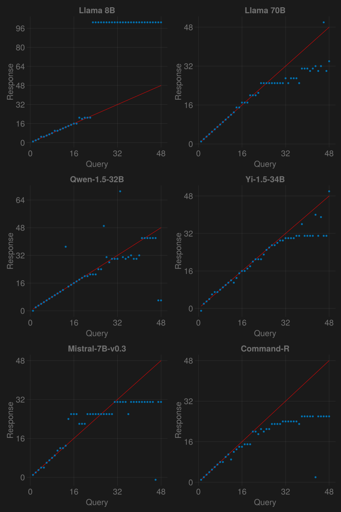

# Large Language Model Reasoning

There is an idea floating around, which has some traction, that LLM intelligence
is illusory. LLMs are an impressive piece of technology, capable of generating
text of higher quality than an average person. As is common---when the magic
wears off and the initial hype dies down---a counter culture forms around the
best ideas of cynics, skeptics, and those who were never impressed.

In this article, I use the words LLM and model interchangeably. I am
specifically referring to modern (in mid 2024) transformer based large language
models, models inheriting from OpenAI's GPT models. These include Llama, Qwen,
Phi, and others. They do not include newer recurrent neural network inspired
models like Mamba, whom have yet to prove themselves.

LLMs tokenize text into **tokens** which get turned into **embeddings**. They
processes the embeddings through their layers, and finally turn the embeddings
back into tokens, and the tokens into text. Embeddings can be considered to be
the thoughts of an LLM. **Attention** is a mechanism that allows the LLM to
_attend_ to the embeddings processed in previous forward passes. For a more
thorough overview of the architecture, see its
[wikipedia page](<https://en.wikipedia.org/wiki/Transformer_(deep_learning_architecture)#Architecture>).

## _Just_ a next-token predictor

[Search for "token predictor" on X for context](https://x.com/search?q=token%20predictor).

LLMs are \'_just_ a next-token predictor\'. The only problem with this phrasing
is the implication of the use of the word \'_just_\'. Architecturally speaking,
LLMs are designed to estimate the probabilities of tokens, making them
next-token predictors as a matter of fact. That is no small feat, however. The
implication is that they can't possess real intelligence.

Let's consider a hypothetical situation in the year 2000. A group of people
receive funding to create an API that performs next-token prediction. The tokens
predicted by the API should be, above all else, as human-like as possible. It
can come at the cost of high latency and low throughput. The group would look
into the state of the art in natural language processing research and find that
we had some ways to go. Ultimately, the best solution would be to place humans
behind the API. They hire people to man the API and create a system to divvy up
the prediction tasks.

This API would be expensive and slow, but it is a next-token predictor, you
might even say that it is _just_ a next-token predictor. If we control for the
latency of the API, there is no way to tell what process is behind it, similar
to modern LLMs.

The humans behind the API possess real intelligence, and by extension, so does
the API. Therefore, the intelligence implication falls apart, as something being
a next-token predictor doesn't preclude it from possessing real intelligence.

There are
[pitfalls with next-token prediction](https://arxiv.org/abs/2403.06963 "arXiv:2403.06963 The pitfalls of next-token prediction"), but
they are issues with the interface to the intelligence, not the nature of it.

## Incapable of reasoning or thought

[](https://x.com/tokyobymouth/status/1789833641117335766 "Because it’s not counting sides. It doesn’t reason or think in any sense of the word.")

https://x.com/tokyobymouth/status/1789833641117335766

This was a part of a discussion about ChatGPT being unable to identify the
number of sides of a regular polygon. It was off by one most of the
time---calling heptagons octagons, or hexagons---and couldn't reliably correct
itself. I'll get to the particulars of this case later, but we start broadly.

### It only goes so deep

LLMs can reason but their architecture limits their capacity for contemplation.
All the thoughts required to obtain the next token must happen in one forward
pass of the neural network.

LLMs have a pre-specified depth. There has been some research that suggests that
[Not all Layers of LLMs are Necessary during Inference](https://arxiv.org/abs/2403.02181 "arXiv:2403.02181 Not all Layers of LLMs are Necessary during Inference").
Easier tasks are often solved in the first layers, while harder ones use the
entire depth of the model.
[ConsistentEE](https://ojs.aaai.org/index.php/AAAI/article/view/29922 "ConsistentEE: A Consistent and Hardness-Guided Early Exiting Method for Accelerating Language Models Inference")
explores the idea of training a model with early exiting logic built in,
reducing inference cost. A corollary to this research is: there must be tasks,
harder than those that use the entire depth, that are unsolvable by the LLM.

<figure>
    <figcaption>### A simplified diagram of an LLM</figcaption>
    
</figure>

This diagram shows how data flows through an LLM. Each column, differentiated by
$$p_n$$ is a separate forward pass. The green nodes at the bottom are the input
tokens. The red nodes at the top are the output tokens. The blue nodes in the
middle are the hidden layers, split at the attention mechanism. The orange
connections from the top to the bottom represent the tokens recurrently passed
from the output, back into the model. The white curvy lines are potential
dataflow through attention.

Simplifying a
[little](<https://en.wikipedia.org/wiki/Transformer_(deep_learning_architecture)#Multi-head_attention> (I'm using "embeddings" to refer to embeddings, keys, queries, and/or values. This looses little relevant meaning and is much less verbose.)); at each layer,
it has access to the embeddings it produced in the previous layer for all the
tokens, shown as curvy connections in the diagram. That is layer $$L_n$$ can
attend to all the embeddings previously produced by layer $$L_{n-1}$$. This
means that data can only flow in the same two orthogonal directions: from older
embeddings to newer ones (right in the diagram), and from shallower layers to
deeper layers (up in the diagram). If a model solves a difficult problem in
layer $$L_n$$, it only has access to the solution in layers $$L_m$$ where $$m
\gt n$$. Hard problems take many layers to solve, so the LLM will only ever be
able to think about this solution in its last layers, which might limit the
insights it can gleam from it, or prevent it from solving another problem, that
depends on this solution.

If the LLM isn't smart enough to think of the right answer in one go, it has
committed to a token that contains, or could lead to, an incorrect answer.
[Chain of thought (CoT)](https://arxiv.org/abs/2205.11916 "arXiv:2205.11916 Large Language Models are Zero-Shot Reasoners")
prompting mitigates this problem to a degree. It gives the LLM space to generate
tokens that don't commit to a final answer, but contain information, and produce
thoughts, that can steer the LLM towards the correct answer.

[Tree of thoughts](https://arxiv.org/abs/2305.10601 "arXiv:2305.10601 Tree of Thoughts: Deliberate Problem Solving with Large Language Models")
and
[LLM adapted Beam search](https://arxiv.org/abs/2305.00633 "arXiv:2305.00633 Self-Evaluation Guided Beam Search for Reasoning")
improve on these ideas further, by letting the LLM explore multiple trains of
thought and reducing commitments to specific tokens.

### The token constraint

Even with this freedom, an LLM still finds its thoughts heavily constrained. CoT
and ToT allow the model to pass information from the later layers, back to the
earlier layers, via the orange connection in
[the diagram](#a-simplified-diagram-of-an-llm "This links to the diagram") above,
by spelling out its insights and solutions. But it must ultimately condense
every thought into a single token that must be grammatically sound, limiting the
information flow.

To make a human analogy: consider Joe, Joe looses all short term memory every 20
seconds. He has to project all his thoughts onto some medium, like a notepad or
a computer, subject to its constraints, before he forgets. Every second he will
remember something relevant to whatever he's thinking about; stretching the
analogy to accommodate attention. I think most people would find this constraint
difficult, but this is the framework LLMs work within. I don't mean to imply
that without these constraints, LLMs were more intelligent. The framework
constrains their intelligence, but is also the means by which they are
intelligent.

[DeepMind's MuZero](https://deepmind.google/discover/blog/muzero-mastering-go-chess-shogi-and-atari-without-rules/ "DeepMind blog: MuZero: Mastering Go, chess, shogi and Atari without rules")
sought to resolve an analogous problem. Its predecessor,
[AlphaZero](https://deepmind.google/discover/blog/alphazero-shedding-new-light-on-chess-shogi-and-go/ "DeepMind blog: AlphaZero: Shedding new light on chess, shogi, and Go")
generated a distribution over legal moves and a win percentage estimate for the
current position. Similarly to an LLM condensing its thoughts into a token,
AlphaZero has to condense all its thoughts into the legal move distribution. It
has no way of relaying insight from one inference step to another. LLMs aren't
as limited. They have the attention mechanism, passing data between forward
passes; and a wider recurrent channel, due to the freedom of choosing between
tokens. MuZero solved this by replacing the board positions (resulting from the
proposed moves) with a _hidden state_ that it can learn to encode arbitrary
ideas within.

It would be interesting to research applying the same idea to LLMs. A simple
implementation could include passing the pre-logit embeddings back into the LLM,
after the token embedding layer; and increasing the d_model size, while
reserving some of the added dimensions for the recurrence. Removing the
one-to-one constraint between tokens and forward passes is another prospect.
[Let's Think Dot by Dot](https://arxiv.org/abs/2404.15758 "arXiv:2404.15758 Let's Think Dot by Dot: Hidden Computation in Transformer Language Models")
explores this idea.

Ease of training has played a significant role in the success of the transformer
architecture. These ideas loose a lot of that due to their RNN inspired
properties---as the chain of dots paper touches on. It might not be practical,
but that hypothesis is worth falsifying.

### There are no heptagons here

Returning to the problem of GPT-4o being unable to reliably distinguish between regular polygons.
OpenAI hasn't disclosed the specifics of any GPT-4 class model, so we don't know exactly how they achieve multimodality.
[LLaVA-1.5](https://arxiv.org/abs/2310.03744 "arXiv:2310.03744 Improved Baselines with Visual Instruction Tuning") recently achieved <abbr data-title="State of The Art">SOTA</abbr> performance on visual instruction following tasks,
which include polygon recognition.
LLaVA encodes an image to be considered as embeddings that are inserted into a standard LLM, in place of regular text derived embedded tokens.
The LLM perceives the image as a sentence, or paragraph, just like other text.
It can contemplate this _description_, but it can't discover anything about the image that wasn't in the description, without guessing or extrapolating.

When a human tries to identify the number of corners on a polygon, they can look at all the corners and count, re-counting to be sure.
This introduces the image, and subsections of it, to the brain for processing.

<abbr data-title="Visual Large Language Models">VLLMs</abbr> only receive the
description once, and typically have no way of re-introducing it, they are
_physically_ incapable of counting the number of sides. For a human it would be
akin to seeing the polygon flash for tens of milliseconds, and having
[aphantasia](https://en.wikipedia.org/wiki/Aphantasia "Wikipedia: The inability
to visualize."). Phantasing humans could potentially count the corners in their
head by visualizing the memory.

To replicate that, a VLLM would need to be able to apply something like
[visual chain of thought reasoning](https://arxiv.org/abs/2305.02317 "arXiv:2305.02317 Visual Chain of Thought: Bridging Logical Gaps with Multimodal Infillings. I saw that it existed so I linked it. It works reasonably well for some tasks, according to the paper."),
which requires the model to be able to produce imagery---or at least embeddings---corresponding to something visual.
The aforementioned recurrent hidden state approach has the potential of facilitating that.

## Exploring their limits

To test the limitations of LLMs; I devised a simple test. I queried six quantized open
chat/instruct models.

| Model                                                                                                                                                   | Layers |
| ------------------------------------------------------------------------------------------------------------------------------------------------------- | ------ |
| [Meta-Llama-3-8B-Instruct-Q6_K](https://huggingface.co/bartowski/Meta-Llama-3-8B-Instruct-GGUF/blob/main/Meta-Llama-3-8B-Instruct-Q6_K.gguf)            | 32     |
| [Meta-Llama-3-70B-Instruct-IQ2_XS](https://huggingface.co/bartowski/Meta-Llama-3-70B-Instruct-old-GGUF/blob/main/Meta-Llama-3-70B-Instruct-IQ2_XS.gguf) | 80     |
| [Qwen1.5-32B-Chat-IQ4_XS](https://huggingface.co/bartowski/Qwen1.5-32B-Chat-GGUF/blob/main/Qwen1.5-32B-Chat-IQ4_XS.gguf)                                | 64     |
| [Yi-1.5-34B-Chat-IQ4_XS](https://huggingface.co/bartowski/Yi-1.5-34B-Chat-GGUF/blob/main/Yi-1.5-34B-Chat-IQ4_XS.gguf)                                   | 60     |
| [Mistral-7B-Instruct-v0.3-Q6_K](https://huggingface.co/bartowski/Mistral-7B-Instruct-v0.3-GGUF/blob/main/Mistral-7B-Instruct-v0.3-Q6_K.gguf)            | 32     |
| [ggml-c4ai-command-r-v01-iq4_xs](https://huggingface.co/dranger003/c4ai-command-r-v01-iMat.GGUF/blob/main/ggml-c4ai-command-r-v01-iq4_xs.gguf) (35B)    | 40     |

I prompted the models with math expressions that add ones repeatedly, like these:

-   $$1=$$
-   $$1+1=$$
-   $$1+1+1=$$
-   etc.

I used each model's preferred chat template. The queries had a
temperature of zero. I adjusted the system prompt until the model only responded
using a single integer.

All the models received the system prompt: <q>You are a calculator that returns a
number. You must only print a single number.</q> Except the Mistral model which needed <q>You
are a calculator that returns a number. You must only print a single number,
nothing else.</q> to comply.

A value of $$n$$ on the **Query** axis corresponds to the prompt
$$\underbrace{1+1+\dots+1}_{n\times}=$$. The **Response** axis represents the
answer from the model. The red line is a the reference line of the correct
score. The blue dots are the responses from the models.


import Table from "./plots/Table";

{<details>

<summary>Click here to show a table containing all 96 rows of the models' outputs.
Red cells indicate values that are too high, while blue cells indicate values that are too low.</summary>
<Table />
</details>}

I find the way their outputs differ interesting.
There is a strong tendency towards certain answers, e.g. Llama 8B always answers 32 after the 39th query.
The larger models don't perform noticably better than the smaller ones.
Yi is the only one whose results contain large overshoots, with 200 appearing twice, at the arbitrary inputs: 53 and 86.
Previously, I ran the experiment using more varied prompts, some of which included a typo.
Yi did not produce these outliers then, neither did it fail on the trivial query: $$1=$$, as it did now, returning $$2$$.
Maybe it thought it was supposed to count.

According to [this online Llama 3 tokenizer](https://belladoreai.github.io/llama3-tokenizer-js/example-demo/build/),
each `1` character and each `+` symbol gets its own token. Therefore the $$n$$th
query contains $$2n$$ tokens of equation, including the equals symbol.
I expect the others to represent the expressions with a similar amount of tokens, considering that the Llama 3 tokenizer is considered large.

To be able to determine the value of the expression correctly, the model has to incorporate information from every token in the sequence, in a single forward pass.
An LLM can't reliably do that, due to each layer only being able to attend to a limited amount of tokens, effectively limiting the area of its receptive field.
A specially trained model could solve this more reliably, but it would likely need to allocate more latent space to this capability, costing it performance in other domains.

Considering the aforementioned limitations on the thinking of LLMs, we should expect them to fail at tasks like these.

The intermediate computations of this type of problem can losslessly be represeted in text.
This can in theory counteract the [token constraint](#the-token-constraint) described above.

### Does thinking step-by-step help?

I re-ran the experiment with the prompt <q>You are a calculator that evaluates math expressions. Write each step of the solution and finally write the answer as an integer like so: Answer: \<integer\></q>.
The step by step reasoning produces a much greater amount of tokens, so it takes longer to run.
Therefore, I only ran it up to $$n=48$$.



The points below the zero line were responses that didn't adhere to the requested format well enough to be parsed easily.

Like before, every model diverges at, or before $$n=32$$.
Their performance is not noticably better than before, which means that they weren't constrained by a lack of space to think, as discussed.
They are likely not smart enough or trained well enough on these types of problems to reliably use a good step by step approach.

The approaches were varied; here are some highlights.

{<details>

<summary>Command-R correctly solved the tenth query using this generalizable method.</summary>
<blockquote>
Step 1: We have 1+1+1+1+1+1+1+1+1+1                           
<br/>Step 2: To add these                                          
<br/>numbers together, we'll use the commutative property to group 
<br/>them in a way that's easy to calculate. We'll add them in     
<br/>pairs: 1+1 = 2, 1+1 = 2, 1+1 = 2, 1+1 = 2, and 1+1 = 2.       
<br/>Step 3:                                                       
<br/> Now, adding up the pairs, we get 2+2+2+2+2 = 10.             
<br/>                                                              
<br/>Answer: 10 
</blockquote>
</details>}

It only used this method once.
The method would in theory be a good way for an LLM to work around its limitations.

{<details>

<summary>Qwen tried the same method with limited success.</summary>
<blockquote>
Step 1: We have a sequence of 13 ones being added together. 
<br/>
<br/>Step 2: We can add them in pairs: (1+1) + (1+1) + (1+1) + 
<br/>(1+1) + (1+1) + (1+1) + (1+1) + 1 
<br/>Step 3: Each pair equals 2: 2 
<br/> + 2 + 2 + 2 + 2 + 2 + 2 + 1 
<br/>Step 4: Continue adding the pairs: 
<br/> 4 + 4 + 4 + 4 + 4 + 4 + 1 
<br/>Step 5: Add the remaining numbers: 8 
<br/> + 8 + 4 + 4 + 4 + 1 
<br/>Step 6: Continue adding: 16 + 8 + 4 + 4 + 
<br/>1 
<br/>Step 7: Add more: 24 + 8 + 4 + 1 
<br/>Step 8: Add the last few: 32 
<br/>+ 4 + 1 
<br/>Step 9: Add the last two: 36 + 1 
<br/>Step 10: The final sum 
<br/>is 37. 
<br/> 
<br/>Answer: 37 
</blockquote>
</details>}

{<details>

<summary>Llama 70B was fond of this approach, using it for all queries up to 38.</summary>
<blockquote>
Step 1: 1+1 = 2
<br/>Step 2: 2+1 = 3 
<br/>Step 3: 3+1 = 4 
<br/>Step 4: 4+1 = 5 
<br/>Step 5: 5+1 = 6 
<br/>Step 6: 6+1 = 7 
<br/>Step 7: 7+1 = 8 
<br/>Step 8: 8+1 = 9 
<br/>Step 9: 9+1 = 10 
<br/>Step 10: 10+1 = 11 
<br/>Step 11: 11+1 = 12 
<br/>Step 12: 12+1 = 13 
<br/>Step 13: 13+1 = 14 
<br/>Step 14: 14+1 = 15 
<br/>Step 15: 15+1 = 16 
<br/>Step 16: 16+1 = 17 
<br/>Step 17: 17+1 = 18 
<br/>Step 18: 18+1 = 19 
<br/>Step 19: 19+1 = 20 
<br/>Step 20: 20+1 = 21 
<br/>Step 21: 21+1 = 22 
<br/>Step 22: 22+1 = 23 
<br/>Step 23: 23+1 = 24 
<br/>Step 24: 24+1 = 25 
<br/>Step 25: 25+1 = 26 
<br/>Step 26: 26+1 = 27 
<br/>
<br/>Answer: 27
</blockquote>
</details>}

The correct answer was 36.

{<details>

<summary>Yi had trouble with the first query.</summary>
<blockquote>
The expression you've provided, "1 =", is incomplete and seems
<br/> to be a single number followed by an equals sign. To         
<br/>interpret this as a math expression that we can solve, we'll  
<br/>need to assume it's part of an equation where "1" is the      
<br/>solution to be found rather than an input to be processed     
<br/>further. However, as it stands, it's not a standard math      
<br/>expression to be solved.                                      
<br/>                                                              
<br/>Given the format you're asking for,                           
<br/>and interpreting your request as looking for a simple math    
<br/>expression that equals 1, we can create a straightforward     
<br/>expression that evaluates to 1 and solve it step by step. For 
<br/>example, let's use the expression \(x = 1\), where we're      
<br/>solving for \(x\).                                            
<br/>                                                              
<br/>Step 1: We are given that \(x = 1\).                          
<br/>                                                              
<br/>Step 2:                                                       
<br/>There are no operations to perform; we are directly given the 
<br/>value of \(x\).                                               
<br/>                                                              
<br/>Step 3: Therefore, \(x\) remains unchanged.                   
<br/>                                                              
<br/>                                                              
<br/>Answer: 1                                                     
<br/>                                                              
<br/>This is a simple case, as typically, you'd expect an          
<br/>expression that involves operations such as addition,         
<br/>subtraction, multiplication, or division. Since the original  
<br/>input was unclear, this response assumes you're looking for a 
<br/>demonstration of how to handle an expression that simplifies  
<br/>to 1. If you had a specific expression in mind or a different 
<br/>type of problem, please provide more details!
</blockquote>
</details>}

Although it didn't help in this case, step-by-step reasoning improves results in many domains, as the paper found.

## Recognizability traps

[](https://x.com/svpino/status/1790624957380342151 "We are still very far from real intelligence. pic.twitter.com/Q4CX9R9jaL")

https://x.com/svpino/status/1790624957380342151

<details>
    <summary>
        The linked image is of a conversation with ChatGPT 4o, replicated here.
    </summary>
    <blockquote>
        <h3>You:</h3>
        <p>
            A man and a goat are in one side of a river. They want to cross it.
            They have a boat. What steps do they need to follow? Write a bullet
            list with the solution. Be as concise as possible.
        </p>
        <h3>ChatGPT:</h3>
        <ol>
            <li>Man takes the goat across the river.</li>
            <li>Man returns alone.</li>
            <li>
                Man takes another load (unspecified, e.g., hay) across the
                river.
            </li>
            <li>Man returns with the goat.</li>
            <li>Man takes remaining load across the river.</li>
            <li>Man returns alone.</li>
            <li>Man takes the goat across the river again.</li>
        </ol>
    </blockquote>
</details>

https://x.com/svpino/status/1790747201783873954

This lapse of reason is hilarious, and there are more like it.
Prompt formats can have a significant effect on the output---for example, by preventing or causing step-by-step reasoning.
I rephrased the question 19 times to see how reliably it would fail the _puzzle_.

import RiverCrossing from "./RiverCrossing";

<RiverCrossing />

I avoided adding hints in the query. It only answered 3 out of 19 questions correctly.
I asked the model further about its **6**th response.
It realized its error at the slightest hint of disagreement, but just elaborating didn't help; it was reliably incorrect.
These methods didn't improve the answer:

-   Chain of thought reasoning, queries **3**, **6**, and other to a lesser degree.
-   Suggesting its answer would likely be wrong, like in query **9**.
-   Adding an orthogonal challenge (talking like a pirate) in query **10**.
-   Asking for an incorrect answer, before the correct one, query **11** and **12**.

Telling GPT that the boat was large, like in queries **13** and **14** was the only hint that gave the correct answer.
Answer **18** was correct but the semantic similarity among queries **16** to **19** make me think it was a fluke.

GPT-4o falls for a similar trap when asked about the health of an already dead Schrödinger's cat.

import Schrodinger from "./Schrodinger";

<Schrodinger />

It took less to get it to see through the trick, in this case.

It is not surprising, in retrospect, that these biases would exist.
Stories about goats, boats, and rivers almost always follow the same pattern, so the model just repeats it.
The easiest way to reliably answer the question correctly in the training data, minimizing the loss, was to memorize it.
If the internet were full of different riddles of a similar nature,
the answers would likely be better, as it would have learned a more general understanding of the situation.

## Our reasoning does not occur in a vacuum

The fundamental building blocks of our thinking are the qualia we've accumulated, and their composition in our minds.
We start with sensing, advance to object permanence, and then to theory of mind, algebra, and other abstract concepts.
These abstractions are increasingly difficult for people to reason about;
so the prevalence of mistakes increases correspondingly.

A logical puzzle that is resolved by realizing that the people in the puzzle have functioning senses, is bound to be trivial.
I couldn't come up with a remotely challenging puzzle with this premise.
I employed ChatGPT 4o to the task, and all the puzzles it made required using higher abstractions like theory of mind.

import SensePuzzle from "./SensePuzzle";

<SensePuzzle />

Matthew Berman, an AI focused commentator, commonly uses a set of questions to test LLMs.
Of those, one requires understanding simple physical properties of everyday objects:

https://x.com/MatthewBerman/status/1736901802568851825

another, object permanence, and theory of mind:

https://x.com/MatthewBerman/status/1736901804238209038

LLMs find these difficult while humans do not, especially the former question.

### They don't reason like us

The primitive sensory-like qualia of an LLM is something like an idea with a position, although it's a little hard to analogize.
The next step in the hierarchy of abstractions is spelling, word structure and frequency.
These are the most elementary ideas to an LLM, and are learned before they know how to speak.
Next up are grammatical structures.
Finally, when all these have been mastered, the LLM can start to think about what it means to see or hear.

It is thus no wonder that such abstract, theoretical musings are elusive to the best of models.
Scenarios, such as one, where a ball is placed in a cup, which is then turned upside down,
and all the logical ramifications of this complex sequence of transformations of abstract phenomena.

They have of course never seen, or interacted with any of these objects.

Research---that I'll fail to cite---has shown that playing with objects, physically, has advantages to cognitive development in children,
when compared to watching TV shows.
My guess is that manipulating your body and interacting with the world is harder, and thus more stimulating;
when compared to passively perceiving something, and only intellectually engaging with it to the degree that the child is capable of.

An LLM can't even do any of this.

### They do reason like us

We attach lots of meaning to the idea of reasoning.
When we see something so blatantly incorrect, it's easy to jump to conclusions.
It's also easy to move goalposts and forget how bad at reasoning humans tend to be.

I showed some friends [the examples shown above](#recognizability-traps), and some (including myself) didn't notice that the cat was dead before entering the box.
There are undoubtedly people who would recognize the boat puzzle at a glance,
and quickly regurgitate the answer to a version of the puzzle they remember solving.
That group is admittedly smaller.

We wouldn't say they're unable to reason; they're just being hasty.
As with a GPT, proper nudging would lead them to the correct answer.
And as with a GPT, further, more intensive, nudging can have them proclaiming an incorrect answer;
to appease those whose appeasement is desired.

I find it unlikely that the summation problem explored above is well represented in the training data---in particular, for the larger sums.
All the models perform reasonably well until around $$n=15$$, which is $$1+1+1+1+1+1+1+1+1+1+1+1+1+1+1$$.
I'd be surprised if no generalization was involved in those answers, and that they were well represented in the data.
It's possible though. The popular datasets like RedPajama, and CommonCrawl, are very large.
If they aren't memorizing it. They are using reasoning to generate the correct answers.

### They reason like themselves

[A paper](https://arxiv.org/abs/2405.17399 "arXiv:2405.17399 Transformers Can Do Arithmetic with the Right Embeddings")
published the day before this was written, found that popular positional embeddings limited the arithmetic capabilities of transformers.
Using a more suitable positional embedding, they trained a model to add 20 digit long numbers.
The model generalized the ability to 100 digit long numbers.
This requires logical inference, and reasoning.

I designed the [diagram of an LLM](#a-simplified-diagram-of-an-llm) shown above, using the Ti<i>k</i>Z syntax of the TeX package `pgf`.
ChatGPT helped me generate it, but I refined it's output.
At one point I had a similar diagram but it only had three rows and three columns of hidden layer nodes.
I wanted one more layer in both directions so I made a query with the TeX code, and these instructions:

> You have been very helpful. I'm quite happy with the style and layout as it is.
> Here is the current state:
>
> \```tex<br/>
>
> <del>Lots of TeX code.</del>
> <br />
> \```
>
> I would however like to rename the hidden layer nodes from $$h_n$$ to $$L_mp_n$$.
> And I would like there to be an extra fourth hidden layer $$L_4$$, and for the whole thing to be one node wider.
> I would also like there to be a spece with vertical ellipsis above the last hidden layer, below the Output Tokens layer.
> can you make those adjustments?

<details>
    <summary>The redacted TeX code, for the curious.</summary>
```tex
\documentclass{article}
\usepackage{tikz}
\usetikzlibrary{positioning, arrows.meta, fit, backgrounds}

\begin{document}
\begin{tikzpicture}[node distance=1cm and 1cm, >=Stealth, thick,
every node/.style={draw, minimum width=1.5cm, minimum height=1cm, align=center, rounded corners=5pt},
input/.style={fill=green!20},
output/.style={fill=red!20},
hidden/.style={fill=gray!20},
attention/.style={->, draw=black!70, thick, densely dashed},
recurrence/.style={->, draw=blue!70, thick, rounded corners}]

% Nodes for input layer
\begin{scope}[local bounding box=input box]
\node[input] (x1) {\tt{<start>}};
\node[input, right=of x1] (x2) {\tt{lorem}};
\node[input, right=of x2] (x3) {\tt{ipsum}};
\end{scope}
\node[fit=(input box), draw, label=left:Input Tokens, inner sep=10pt] {};

% Nodes for hidden layer L1
\begin{scope}[local bounding box=l1 box]
\node[hidden, above=of x1] (l1h1) {$L_{1}p_1$}; %this one is marked
\node[hidden, right=of l1h1] (l1h2) {$h_2$};
\node[hidden, right=of l1h2] (l1h3) {$h_3$};
\end{scope}
\node[fit=(l1 box), draw, label=left:$L_1$, inner sep=10pt] {};

% Nodes for hidden layer L2
\begin{scope}[local bounding box=l2 box]
\node[hidden, above=of l1h1] (l2h1) {$h_1$};
\node[hidden, right=of l2h1] (l2h2) {$h_2$};
\node[hidden, right=of l2h2] (l2h3) {$h_3$};
\end{scope}
\node[fit=(l2 box), draw, label=left:$L_2$, inner sep=10pt] {};

% Nodes for hidden layer L3
\begin{scope}[local bounding box=l3 box]
\node[hidden, above=of l2h1] (l3h1) {$h_1$};
\node[hidden, right=of l3h1] (l3h2) {$h_2$};
\node[hidden, right=of l3h2] (l3h3) {$h_3$};
\end{scope}
\node[fit=(l3 box), draw, label=left:$L_3$, inner sep=10pt] {};

% Nodes for output layer
\begin{scope}[local bounding box=output box]
\node[output, above=of l3h1] (y1) {\tt{lorem}};
\node[output, right=of y1] (y2) {\tt{ipsum}};
\node[output, right=of y2] (y3) {\tt{dolor}};
\end{scope}
\node[fit=(output box), draw, label=left:Output Tokens, inner sep=10pt] {};

% input tokens to L1
\draw[->] (x1) -- (l1h1);
\draw[->] (x2) -- (l1h2);
\draw[->] (x3) -- (l1h3);

% attention connections from L1 to L2
\draw[attention] (l1h1) -- (l2h1);
\draw[attention] (l1h1) -- (l2h2);
\draw[attention] (l1h1) -- (l2h3);
\draw[attention] (l1h2) -- (l2h2);
\draw[attention] (l1h2) -- (l2h3);
\draw[attention] (l1h3) -- (l2h3);

% attention connections from L2 to L3
\draw[attention] (l2h1) -- (l3h1);
\draw[attention] (l2h1) -- (l3h2);
\draw[attention] (l2h1) -- (l3h3);
\draw[attention] (l2h2) -- (l3h2);
\draw[attention] (l2h2) -- (l3h3);
\draw[attention] (l2h3) -- (l3h3);

% final hidden layer to output tokens
\draw[->] (l3h1) -- (y1);
\draw[->] (l3h2) -- (y2);
\draw[->] (l3h3) -- (y3);

% autoregressive recurrence

% Draw the recurrence connections with waypoints
\node[coordinate, above right=0.75cm and 0.5cm of y1] (p1o) {};
\node[coordinate, below right=0.75cm and 0.5cm of x1] (p1i) {};
\draw[recurrence] (y1.north) |- (p1o) -- (p1i) -| (x2.south);

\node[coordinate, above right=0.75cm and 0.5cm of y2] (p2o) {};
\node[coordinate, below right=0.75cm and 0.5cm of x2] (p2i) {};
\draw[recurrence] (y2.north) |- (p2o) -- (p2i) -| (x3.south);

\end{tikzpicture}
\end{document}

```
</details>

import LatexDiagramCode from "./LatexDiagramCode";

<details>
    <summary>The response from ChatGPT.</summary>
    <LatexDiagramCode />
</details>

The response contained the updated code, perfectly reflecting the demands of the request.
There was one error. It defined an extra style variable, which referenced itself, creating an infinite loop in the rendering logic.
After finding, and fixing it, $$\LaTeX$$ generated the diagram successfully.

The ellipsis didn't look good, so I removed them.
To achieve this, the model had to change the three groups of three nodes to four groups of four, extrapolating the variable names.
It had to transform these extrapolated variable names from $$h_n$$ to $$L_mp_n$$.
It had to make the orange recurrent connection, and the dashed ones.
Finally it had to see the pattern that $$L_mp_n$$ had connections to all $$\forall L_xp_y$$ where $$m = x+1$$ and $$n \geq y$$.
In other words, $$L_np_1$$ has one incoming connection from a lower layer, $$L_np_2$$ has two, and so on.

Understanding this description---written with symbols---is, to most, not easy.
It serves as an illustrative example of thinking in foreign abstractions.

In fairness, the text-native manipulation that the instructions entail are not foreign to an LLM.
And the less abstract, structured text the code presented to the LLM, made it easier to see patterns to extrapolate.

Quantifying reasoning is hard, but it seems absurd to think of this task as requiring no reasoning.
```
