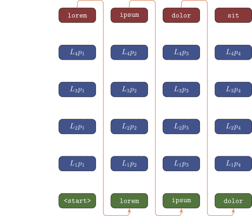

# Large Language Model Reasoning

There is an idea floating around, which has some traction, that LLM intelligence
is illusory. LLMs are an impressive piece of technology, capable of generating
text of higher quality than an average person. As is common---when the magic
wears off and the initial hype dies down---a counter culture forms around the
best ideas of cynics, skeptics, and those who were never impressed.

In this article, I use the words LLM and model interchangeably. I am
specifically referring to modern (in mid 2024) transformer based large language
models, models inheriting from OpenAI's GPT models. These include Llama, Qwen,
Phi, and others. They do not include newer recurrent neural network inspired
models like Mamba, whom have yet to prove themselves.

LLMs tokenize text into **tokens** which get turned into **embeddings**. They
processes the embeddings through their layers, and finally turn the embeddings
back into tokens, and the tokens into text. Embeddings can be considered to be
the thoughts of an LLM. **Attention** is a mechanism that allows the LLM to
_attend_ to the embeddings processed in previous forward passes. For a more
thurough overview of the architecture, see its
[wikipedia page](https://en.wikipedia.org/wiki/Transformer_(deep_learning_architecture)#Architecture)

## _Just_ a next-token predictor

[Search for "token predictor" on X for context](https://x.com/search?q=token%20predictor).

LLMs are \'_just_ a next-token predictor\'. The only problem with this phrasing
is the implication of the use of the word \'_just_\'. Architecturally speaking,
LLMs are designed to estimate the probabilities of tokens, making them
next-token predictors as a matter of fact. That is no small feat, however. The
implication is that they can't possess real intelligence.

Let's consider a hypothetical situation in the year 2000. A group of people
receive funding to create an API that performs next-token prediction. The tokens
predicted by the API should be, above all else, as human-like as possible. It
can come at the cost of high latency and low throughput. The group would look
into the state of the art in natural language processing research and find that
we had some ways to go. Ultimately, the best solution would be to place humans
behind the API. They hire people to man the API and create a system to divvy up
the prediction tasks.

This API would be expensive and slow, but it is a next-token predictor, you
might even say that it is _just_ a next-token predictor. If we control for the
latency of the API, there is no way to tell what process is behind it, similar
to modern LLMs.

The humans behind the API possess real intelligence, and by extension, so does
the API. Therefore, the intelligence implication falls apart, as something being
a next-token predictor doesn't preclude it from possessing real intelligence.

There are
[pitfalls with next-token prediction](https://arxiv.org/abs/2403.06963), but
they are issues with the interface to the intelligence, not the nature of it.

## Incapable of reasoning or thought

https://x.com/tokyobymouth/status/1789833641117335766

This was a part of a discussion about ChatGPT being unable to identify the
number of sides of a regular polygon. It was off by one most of the
time---calling heptagons octagons, or hexagons---and couldn't reliably correct
itself. I'll get to the particulars of this case later, but we start broadly.

### It only goes so deep

LLMs can reason but their architecture limits their capacity for contemplation.
All the thoughts required to obtain the next token must happen in one forward
pass of the neural network.

LLMs have a pre-specified depth. There has been some research that suggests that
[Not all Layers of LLMs are Necessary during Inference](https://arxiv.org/abs/2403.02181 "arXiv:[2403.02181] Not all Layers of LLMs are Necessary during Inference").
Easier tasks are often solved in the first layers, while harder ones use the
entire depth of the model.
[ConsistentEE](https://ojs.aaai.org/index.php/AAAI/article/view/29922 "ConsistentEE: A Consistent and Hardness-Guided Early Exiting Method for Accelerating Language Models Inference")
explores the idea of training a model with early exiting logic built in,
reducing inference cost. A corollary to this research is: there must be tasks,
harder than those that use the entire depth, that are unsolvable by the LLM.

### A simplified diagram of an LLM

This diagram shows how data flows through an LLM. Each column, differentiated by
$$p_n$$ is a separate forward pass. The green nodes at the bottom are the input
tokens. The red nodes at the top are the output tokens. The blue nodes in the
middle are the hidden layers, split at the attention mechanism. The orange
connections from the top to the bottom represent the tokens recurrently passed
from the output, back into the model. The white curvy lines are potential
dataflow through attention.

Simplifying a
[little](https://en.wikipedia.org/wiki/Transformer_%28deep_learning_architecture%29#Multi-head_attention
"I'm using "embeddings" to refer to embeddings, keys, queries, and/or values.
This looses little relevant meaning and is much less verbose."); at each layer,
it has access to the embeddings it produced in the previous layer for all the
tokens, shown as curvy connections in the diagram. That is layer $$L_n$$ can
attend to all the embeddings previously produced by layer $$L_{n-1}$$. This
means that data can only flow in the same two orthogonal directions: from older
embeddings to newer ones (right in the diagram), and from shallower layers to
deeper layers (up in the diagram). If a model solves a difficult problem in
layer $$L_n$$, it only has access to the solution in layers $$L_m$$ where $$m
\gt n$$. Hard problems take many layers to solve, so the LLM will only ever be
able to think about this solution in its last layers, which might limit the
insights it can gleam from it, or prevent it from solving another problem, that
depends on this solution.

If the LLM isn't smart enough to think of the right answer in one go, it has
committed to a token that contains, or could lead to, an incorrect answer.
[Chain of thought (CoT)](https://arxiv.org/abs/2205.11916 "arXiv:[2205.11916] Large Language Models are Zero-Shot Reasoners")
prompting mitigates this problem to a degree. It gives the LLM space to generate
tokens that don't commit to a final answer, but contain information, and produce
thoughts, that can steer the LLM towards the correct answer.

[Tree of thoughts](https://arxiv.org/abs/2305.10601 "arXiv:[2305.10601] Tree of Thoughts: Deliberate Problem Solving with Large Language Models")
and
[LLM adapted Beam search](https://arxiv.org/abs/2305.00633 "arXiv:[2305.00633] Self-Evaluation Guided Beam Search for Reasoning")
improve on these ideas further, by letting the LLM explore multiple trains of
thought and reducing commitments to specific tokens.

### The token constraint

Even with this freedom, an LLM still finds its thoughts heavily constrained. CoT
and ToT allow the model to pass information from the later layers, back to the
earlier layers, via
[the orange connection in the diagram](#a-simplified-diagram-of-an-llm "This links to the diagram"),
by spelling out its insights and solutions. But it must ultimately condense
every thought into a single token that must be grammatically sound, limiting the
information flow.

To make a human analogy: consider Joe, Joe looses all short term memory every 20
seconds. He has to project all his thoughts onto some medium, like a notepad or
a computer, subject to its constraints, before he forgets. Every second he will
remember something relevant to whatever he's thinking about; stretching the
analogy to accommodate attention. I think most people would find this constraint
difficult, but this is the framework LLMs work within. I don't mean to imply
that without these constraints, LLMs were more intelligent. The framework
constrains their intelligence, but is also the means by which they are
intelligent.

[DeepMind's MuZero](https://deepmind.google/discover/blog/muzero-mastering-go-chess-shogi-and-atari-without-rules/ "DeepMind blog: MuZero: Mastering Go, chess, shogi and Atari without rules")
sought to resolve an analogous problem. Its predecessor,
[AlphaZero](https://deepmind.google/discover/blog/alphazero-shedding-new-light-on-chess-shogi-and-go/ "DeepMind blog: AlphaZero: Shedding new light on chess, shogi, and Go")
generated a distribution over legal moves and a win percentage estimate for the
current position. Similarly to an LLM condensing its thoughts into a token,
AlphaZero has to condense all its thoughts into the legal move distribution. It
has no way of relaying insight from one inference step to another. LLMs aren't
as limited. They have the attention mechanism, passing data between forward
passes; and a wider recurrent channel, due to the freedom of choosing between
tokens. MuZero solved this by replacing the board positions (resulting from the
proposed moves) with a _hidden state_ that it can learn to encode arbitrary
ideas within.

It would be interesting to research applying the same idea to LLMs. A simple
implementation could include passing the pre-logit embeddings back into the LLM,
after the token embedding layer; and increasing the d_model size, while
reserving some of the added dimensions for the recurrence. Removing the
one-to-one constraint between tokens and forward passes is another prospect.
[Let's Think Dot by Dot](https://arxiv.org/abs/2404.15758 "arXiv:[2404.15758] Let's Think Dot by Dot: Hidden Computation in Transformer Language Models")
explores this idea.

Ease of training has played a significant role in the success of the transformer
architecture. These ideas loose a lot of that due to their RNN inspired
properties---as the chain of dots paper touches on. It might not be practical,
but that hypothesis is worth falsifying.

## TODO: A good title relating to them being dumb/limited

To test these limitations I devised a simple test. I queried six open
chat/instruct models.

| Model                                                                                                                                                   |
| ------------------------------------------------------------------------------------------------------------------------------------------------------- |
| [Meta-Llama-3-8B-Instruct-Q6_K](https://huggingface.co/bartowski/Meta-Llama-3-8B-Instruct-GGUF/blob/main/Meta-Llama-3-8B-Instruct-Q6_K.gguf)            |
| [Meta-Llama-3-70B-Instruct-IQ2_XS](https://huggingface.co/bartowski/Meta-Llama-3-70B-Instruct-old-GGUF/blob/main/Meta-Llama-3-70B-Instruct-IQ2_XS.gguf) |
| [Qwen1.5-32B-Chat-IQ4_XS](https://huggingface.co/bartowski/Qwen1.5-32B-Chat-GGUF/blob/main/Qwen1.5-32B-Chat-IQ4_XS.gguf)                                |
| [Yi-1.5-34B-Chat-IQ4_XS](https://huggingface.co/bartowski/Yi-1.5-34B-Chat-GGUF/blob/main/Yi-1.5-34B-Chat-IQ4_XS.gguf)                                   |
| [Mistral-7B-Instruct-v0.3-Q6_K](https://huggingface.co/bartowski/Mistral-7B-Instruct-v0.3-GGUF/blob/main/Mistral-7B-Instruct-v0.3-Q6_K.gguf)            |
| [ggml-c4ai-command-r-v01-iq4_xs](https://huggingface.co/dranger003/c4ai-command-r-v01-iMat.GGUF/blob/main/ggml-c4ai-command-r-v01-iq4_xs.gguf)          |

I prompt the models with math expressions like $$1=$$, $$1+1=$$, $$1+1+1=$$, and
so on, using their respective preferred chat template. Each query had a
temperature of zero. I adjusted the system prompt until the model only responded
using a single integer. Some models required more convincing than others.

All the models received the system prompt: <q>You are a calculator that returns a
number. You must only print a single number.</q> Except Mistral which needed <q>You
are a calculator that returns a number. You must only print a single number,
nothing else.</q> to comply. Llama 8B and 70B received the system prompt: "You are
a calculator that prints numbers." Qwen 1.5 32B, Yi 1.5 34B, and Mistral 7B v0.3
needed a more firm "You are a calculator that prints number. You must only print
a single number, don't write any text." The system prompt included a typo, but
that doesn't have an important effect on the results, with respect to .
Command-R required the most convincing and used: "You are a calculator that
prints number. You must only print a single number, don't write any text or
punctuation." The larger models were quantized down to less than 24GB using
llama.cpp IQ quantizations.

A value of $$n$$ on the **Query** axis corresponds to the prompt
$$\underbrace{1+1+\dots+1}_{n\times}=$$. The **Response** axis represents the
answer from the model. The red line is a the reference line of the correct
score. The blue dots are the responses from the models.

import Table from "./plots/Table";

 Here is a table containing all 96 rows of the models' outputs. Red and blue cells indicate values that are too high and too low, respectively. 
<Table />

They all have the same I find the way they differ in performance interesting.

According to
[this online Llama 3 tokenizer](https://belladoreai.github.io/llama3-tokenizer-js/example-demo/build/),
each `1` character and each `+` symbol gets its own token. Therefore the $$n$$th
query contains $$2n-1$$ tokens of equation, excluding the equals symbol.

## TODO: Weird overfitting

https://x.com/svpino/status/1790624957380342151

The linked image is of a conversation with ChatGPT 4o which goes like this:

<blockquote><h3>You:</h3>A man and a goat are in one side of a river. They want to cross it. They have a boat. What steps do they need to follow?
Write a bullet list with the solution. Be as concise as possible.
<h3>ChatGPT:</h3>
<ol><li>Man takes the goat across the river.</li>
<li>Man returns alone.</li>
<li>Man takes another load (unspecified, e.g., hay) across the river.</li>
<li>Man returns with the goat.</li>
<li>Man takes remaining load across the river.</li>
<li>Man returns alone.</li>
<li>Man takes the goat across the river again.</li></ol></blockquote>

https://x.com/svpino/status/1790747201783873954

LLMs are limited in their capacity for contemplation. Their ideas must be
squeezed through the tokenizer to be retreivable again in the next iteration of
thought via methods like chain of thought reasoning. That internal dialogue is
constrained by the grammatical correctness of language which likely limits the
expressivity of the thoughts.

Some people like to call them stochastic parrots
